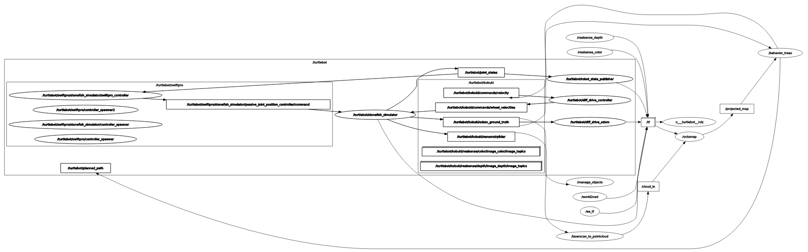

# Define a "Pickup objects" task using behavior trees

## Delivered by

* `Mazen Elgabalawy - u199109`
* `Adel Saidani - u6104239`

This lab uses the UdG turtlebot simulation in Stonefish using ROS noetic to complete an object collecting task making use of the  [py_trees](https://github.com/splintered-reality/py_trees) library. The objective included implementing a behavior tree that allows the robot to do path planning, path following, and collecting and dropping objects from and at the correct locations.

## `py_trees` library

This lab uses the [py_trees](https://github.com/splintered-reality/py_trees) library.
To install the `py_trees` library do:

```bash
pip install py_trees
```

You can find information about how to use this library at this [github page](https://github.com/splintered-reality/py_trees).

There is also a [tutorial](./notebooks/py_tree_tests.ipynb) included in this package. Check it for a brief introduction.

## Execution Instructions

### Terminal 1 (Simulation)

```bash
roslaunch pick_up_objects_task stonefish.launch
```

### Terminal 2 (Behavior Tree)

```bash
rosrun pick_up_objects_task pickup_behaviors_node.py
```

## Task description

We have a robot with the follwong behaviors:

* `move`: The robot move to the *x*, *y* location. This behavior is provided by the node [turtlebot_controller_node.py](./src/turtlebot_controller_node.py) from this package.
* `check_object`: A service provided by the [manage_objects_node.py](./src/manage_objects_node.py). It returns `False` if no object is close to the robot and `True` plus the object's name if an object is close to it.
* `get_object`: A service provided by the [manage_objects_node.py](./src/manage_objects_node.py). It returns `False` if no object is close to the robot and `True` if an object is close to it. It also moves this object over the robot.
* `let_object`: A service provided by the [manage_objects_node.py](./src/manage_objects_node.py). It returns `False` if no object is over the robot and `True` if an object is over it. It also moves this object to the floor.

Using these behaviors, you have to implement the following task.

The robot has to navigate to a list of points and in each one it has to check if there is an object on it. If there is an object, it picks it up and takes it to `(-0.5, 3.5)`. Once there, the robot leaves the object and goes to the next point. The task ends once all objects have been collected. The points where the objects can be found are:

* (1.4, 0.7)
* (2.4, 3.15)
* (0.7, 2.5)

The goal points for the robot consists of (x,y,θ) and are:

* (1.65,0.75, π)
* (2.2,3.0,0.633)
* (0.7,2.2,π)

The for dropping the objects, the robot goes to the point

* (-0.2,3.5,3.14)

<p align="center">  </p>

## Behavior Tree

The behaviors used and implemented were as follows:

* `SetGoalNextBall`: Behavior to set the goal position towards the next ball in the list.
* `SetGoalDropPoint`: Behavior to set the goal to the predetermined drop station.
* `PlanPath`: Behavior used to plan a path to the desired goal. Here, RRT with smoothing was used as the planning algorithm.
* `FollowPath`: Behavior to follow the planned path by the PlanPath behavior. It continuously checks the path, and if it is valid, sends velocity commands to the robot. Otherwise, returns failure and a new path must be planned.
* `CorrectOrientation`: Behavior used to correct the orientation of the robot before picking the object. This is used to ensure that the object is picked at the front of the robot so it is correctly dropped in the bin.
* `ChangePose`: Behavior that changes the robot pose if it is stuck during planning, or after picking up an object to ensure clearance of obstacles.
* `CheckObject`: Behavior to check if an object is within a valid distance for pick up.
* `GetObject`: Behavior to pick up and object.
* `LetObject`: Behavior to let go of an object.

#### Tree Structure

Some behaviors are always used together (e.g. PlanPath and FollowPath), so they were put in sub-tree structures to be used more easily.

* `PlanSubTree`: Contains the `PlanPath` and the  `ChangePose` behaviors in a selector block. This is used so if robot is stuck during planning due to an obstacle, it can change poses and replan again.
* `PlanAndFollow`: Contains the `PlanSubTree`, `FollowPath` and `CorrectOrientation` behaviors in a Sequence block to ensure the robot reaches the required goal in the correct pose.

<p align="center">  </p>

## RQT Graph

<p align="center">  </p>

## Task Video

The following video (click to play) shows successful execution of the task.

[](https://youtu.be/7k0EcvV1Urg)

## Conclusion

This project implemented a behavior tree using `py_trees` to autonomously control a TurtleBot in completing an object collection task. The robot successfully navigated to target locations, detected objects using the `check_object` service, collected them via `get_object`, and delivered them to the drop point using `let_object`.

Behavior trees proved particularly effective for this task because:

* They naturally handled the sequential workflow (navigation → detection → collection → delivery)
* The tree structure clearly managed conditional behaviors (only collecting when objects were detected)
* Modular design allowed easy maintenance and modification of individual behaviors
* Sub-trees like `PlanAndFollow` (combining `PlanPath` and `FollowPath`) encapsulated complex logic into reusable components

The implementation demonstrated that behavior trees are well-suited for robotic tasks requiring:

1. Ordered execution of multiple actions
2. Conditional behavior based on environment state
3. Clean failure handling and recovery

This approach could be extended to more complex scenarios by adding additional behaviors while maintaining the same organized structure.

*Mazen Elgabalawy -  
Last review March 2025.*
